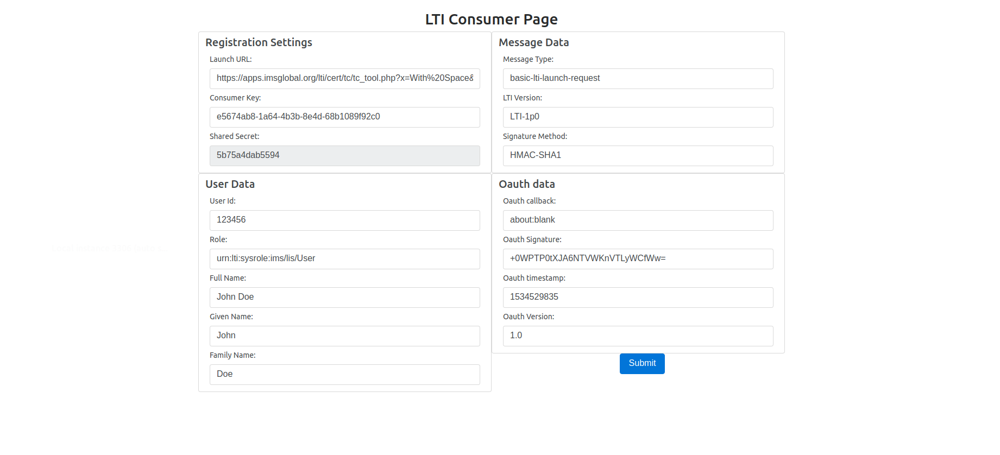

##  LTI TOOL CONSUMER

#### Running the Tool Consumer

1. Clone this repository to your local system

    ``
    git clone https://github.com/sharvilshah1994/LTI-Tool-Consumer.git
    ``
2. Go to `
         LTI-Tool-Consumer/src/main/java/com/lti/toolconsumer/ParamConfig.java
       ` and edit the Parameters as per your requirements. 
       
3. Generate the JAR file 

    ``
    cd LTI-Tool-Consumer/
    ``
    
    ``mvn clean install``
    
4. Run the application 

    ``java -jar target/toolconsumer-0.0.1-SNAPSHOT.jar``
    
Hit the following URL on your browser:

``localhost:8085``

You will see the following page:

